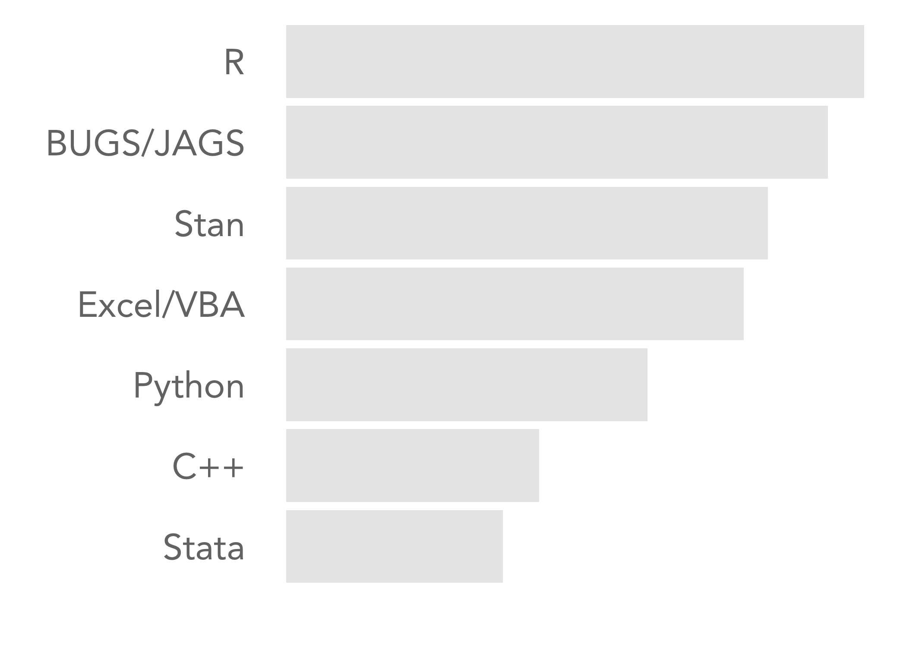

```{r, echo=FALSE, include=FALSE}
knitr::opts_chunk$set(
  results='asis', 
  echo = FALSE
)

setwd(dir = "/Users/joshuamusson/Desktop/Analytics/R/CV_resume/")

library(glue)
library(tidyverse)
library(ggthemes)
library(wesanderson)
library(ggsci)
library(extrafont)
library(ggridges)
library(data.table)

skills <- read_csv("csvs/language_skills.csv")
```


Aside
================================================================================
```{r, echo=FALSE, include=FALSE}
set.seed(55)
data <- data.frame(a = rnorm(n = 10000, mean = 0, sd = 1.6), 
                   b = rnorm(n = 10000, mean = -.2, sd = 1.5),
                   c = rnorm(n = 10000, mean = -.6, sd = 1.4), 
                   d = rnorm(n = 10000, mean = -1, sd = 1.2),
                   e = rnorm(n = 10000, mean = -1.4, sd = 1),
                   f = rnorm(n = 10000, mean = -1.8, sd = .8),
                   g = rnorm(n = 10000, mean = -2.2, sd = .6),
                   h = rnorm(n = 10000, mean = -2.4, sd = .5),
                   i = rnorm(n = 10000, mean = -2.8, sd = .4),
                   j = rnorm(n = 10000, mean = -3, sd = .3))

data <- melt(data)
colnames(data) <- c("Cat", "Dens")

ggplot(data, aes(x = Dens)) + 
  geom_line(aes(color = Cat), stat = "density", size = 1, alpha = .45, show.legend = FALSE) +
    theme(axis.text.x = element_blank(),axis.ticks.x = element_blank(), 
        axis.ticks.y = element_blank(), panel.grid.major.y = element_blank(),
        panel.grid.major.x = element_blank(), axis.line.x = element_blank(),
        plot.background = element_rect(fill = "transparent", colour = NA),
        panel.grid = element_blank()) +
  scale_color_grey() +
  theme_void() +
  ggsave(filename = "myLogo.png", bg = "transparent")
```

{width=100%}


Contact {#contact}
--------------------------------------------------------------------------------

- <i class="fa fa-envelope"></i> [Email](mailto:soboil.joshua@gmail.com)
- <i class="fa fa-github"></i> [Github Profile](https://github.com/jSoboil)
- <i class="fa fa-linkedin"></i> [LinkedIn Profile](https://www.linkedin.com/in/joshua-soboil-067351172/)
- <i class="fa fa-phone"></i> +27 76 790 5751
- <i class="fa fa-home"></i> Cape Town, ZAR


Programming Skills {#skills}
--------------------------------------------------------------------------------

```{r, echo=FALSE, include=FALSE}
skills %>%
ggplot(aes(skill, level)) +
  geom_bar(aes(x = reorder(skill, level), y = level, alpha = .1),
           stat = "identity", show.legend = FALSE, fill = "grey84") +
  theme_gdocs(base_size = 15) +
  theme(axis.text.x = element_blank(),axis.ticks.x = element_blank(), 
        axis.ticks.y = element_blank(), panel.grid.major.y = element_blank(), 
        panel.grid.major.x = element_blank(), axis.line.x = element_blank(), 
        axis.text.y = element_text(face = "bold", size = 20, family = "Courier"), 
        plot.background = element_rect(fill = "transparent", colour = NA)) +
  ylab("") +
  xlab("") +
  coord_flip() +
  ggsave(filename = "skillsBar.png", bg = "transparent")
```

{width=100%}


References {#references}
--------------------------------------------------------------------------------

*References made available upon request*


Disclaimer {#disclaimer}
--------------------------------------------------------------------------------

This resume was made with the R package [**pagedown**](https://github.com/rstudio/pagedown).

View project code [**here**](https://github.com/jSoboil/CV/tree/master)

Last updated on `r Sys.Date()`.


Main
================================================================================

Joshua Soboil {#title}
--------------------------------------------------------------------------------

### Health Economist

Seeking to develop career in the HEOR field. Undergraduate degree provided a mature and holistic understanding of complex socio-economic systems. An eye for detail coupled with deep intrigue for statistics and economics spurred on the development of skills over and above required for Master's. Thus, has deep health economic modelling skills with a high programming proficiency. 

Experience in varied backgrounds, with a passion for continuous learning, provides a uniquely diverse skill set. Particularly interested in developing cost-effectiveness models and other HTA roles.


Education {data-icon=graduation-cap data-concise=true}
--------------------------------------------------------------------------------

### University of Cape Town

MPH, Health Economics

Cape Town, ZAR

2019 - 2020

Thesis title: A Framework for Incorporating a Fully-Integrated Bayesian Approach to Cost-Effectiveness Evaluation in a Middle-Income Country Context.

### Stellenbosch University

BA(Hons), Sociology

Stellenbosch, ZAR

2018

Thesis title: Astronomy in the Age of Big Data. [Read here](https://cosmopolitankaroo.co.za/wp-content/uploads/2017/04/J-Musson-Honours-Research-Report-final-March-2019.pdf).

Research conducted under the guidance of the South African Research Chair in the Sociology of Land, Environment and Sustainable Development.

### Stellenbosch University

BA, Social Dynamics

Stellenbosch, ZAR

2014 - 2017

Majors in Sociology and Psychology, with a minor in Philosophy and exposure to undergraduate economics.

  

Selected Experience {data-icon=suitcase}
--------------------------------------------------------------------------------

### Development Director

Periods For Hope

Cape Town, ZAR

Jan 2019 - Dec 2020

::: concise
- A registered NPO (226-728) focused on the reduction of period poverty and stigma.
- Led capacity development.
- Responsible for development of sustainable funding networks and strategies ensuring future growth of the organisation.
:::

### Associate Consultant

Freedom House

Cape Town, ZAR

Sep 2018 - Mar 2019

::: concise
- Reviewed South African Community Based Monitoring (CBM) tools; at both local and national levels.
- Qualitative research role.
- Data collection and analysis.
:::


Selected Certificates {data-icon=certificate}
--------------------------------------------------------------------------------

### Health Systems Strengthening

Short course

futurelearn.com, Online

2020

In partnership with the Nossal Institute for Global Health and unicef. The course explored health systems concepts, structure, function and approaches to strengthening health systems.

[View Certificate](https://www.futurelearn.com/certificates/5nafhw3)

### Human Research

Short course 

citiprogram.org, Online

2019

A research ethics certificate course provided by the Collaborative Institutional Training Initiative (CITI), under the requirements set by the Comprehensive International Program of Research on AIDS (CIPRA).

[View Certificate](https://www.citiprogram.org/verify/?wd09fbf64-1a5e-476b-ab1d-82c7b5a8a61c-32582541)


Awards {data-icon=trophy}
--------------------------------------------------------------------------------

### NRF Health Economics Bursary

HEU

Cape Town, ZAR

2019

Awarded by the National Research Chair of Health Economics.

### DST/NRF Sociology Research Bursary

Cosmopolitan Karoo

Stellenbosch, ZAR

2018

Awarded by the National Research Chair of Sociology of Land, Environment and Sustainable Development.


Selected Volunteering {data-icon=hand-paper}
--------------------------------------------------------------------------------

### Peer Mentor

MPH Mentor Programme

Cape Town, ZAR

2020

Received mentor training to help orientate first year UCT MPH students.

### Mentor

Inkhamva Youth

Cape Town, ZAR

2019

Provided career mentorship to underprivileged matriculant learners enrolled in the Inkhamva Youth programme.

### Volunteer

International AIDS Conference

Amsterdam, NL

2018

Assisted delegates during the International Aids Conference.